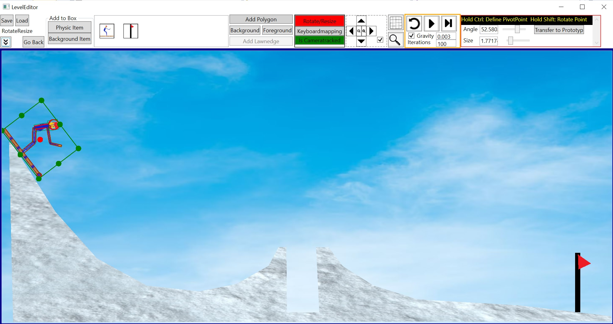
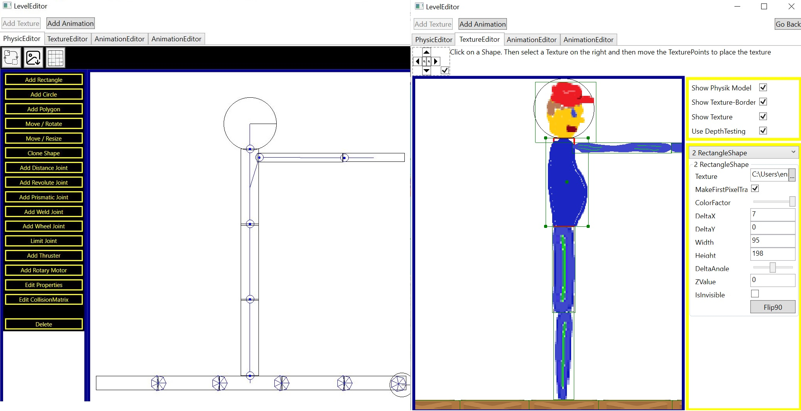
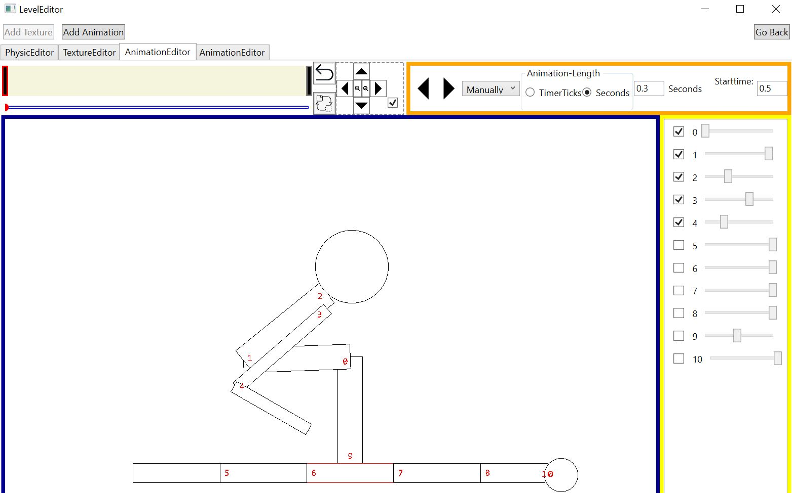

RigidBodyPhysics
============
This is a 2D physics engine which simulates the movement from rigid bodys. It is using sequentill impules like Box2D from Erin Catto.
I created this engine to get a better understanding how Box2D works and to use it for my games.

There is a long documentation in [german](./PhysicEngine/Dokumentation/Dokumentation.pdf) and a shorter one in [english](https://github.com/XMAMan/SmallSI).

Images
------
Example-Games using this Engine:

There is also a editor for creating the Physicdata which will be animated:

Features
--------
Supported Bodies:
* Rectangle
* Circle
* Polygon (convex/concave)

Supported Joints
* Distance Joint 
* Prismatic Joint
* Revolute Joint
* Weld Joint
* Wheel Joint

Ways to create extern forces to the bodies:
* Gravity
* Rotary Motor
* Thruster
* Move object by mouse
* Friction

Dependencies
------------
* Newtonsoft.Json
* PowerArgs
* ReactiveUI
* FluentAssertions
* xunit
* https://github.com/XMAMan/GraphicEngine8
* https://github.com/XMAMan/SoundEngine

Todo
----
* better broudhphase for the collision detection

Related work
------------
* https://github.com/erincatto/box2d

Used Papers/Tutorials/Links
---------------------------
* Rigid Body Simulation - David Baraff 2001
* Iterative Dynamics with Temporal Coherence - Erin Catto 2005
* Constraint based physics solver - Marijn 2015
* Comparison between Projected Gauss-Seidel and Sequential Impulse Solvers for Real-Time Physics Simulations - Marijn 2015
* 3D Constraint Derivations for Impulse Solvers - Marijn 2015
* Soft Constraints - Erin Catto 2011
* Constraint-Based Physics - Ming-Lun Allen Chou 2014
* Building a 2D Game Physics Engine: Using HTML5 and JavaScript (English Edition)
* https://www.toptal.com/game/video-game-physics-part-i-an-introduction-to-rigid-body-dynamics
* https://github.com/erincatto/box2d-lite
* https://github.com/erincatto/box2d
* https://raphaelpriatama.medium.com/sequential-impulses-explained-from-the-perspective-of-a-game-physics-beginner-72a37f6fea05
* https://www.myphysicslab.com/engine2D/collision-en.html
* https://www.myphysicslab.com/engine2D/collision-methods-en.html
* https://www.myphysicslab.com/engine2D/contact-en.html
* https://www.myphysicslab.com/develop/docs/Engine2D.html
* https://research.ncl.ac.uk/game/mastersdegree/gametechnologies/physicstutorials/8constraintsandsolvers/Physics%20-%20Constraints%20and%20Solvers.pdf
* https://www.youtube.com/watch?v=SHinxAhv1ZE
* http://allenchou.net/2013/12/game-physics-resolution-contact-constraints/
* https://web.iit.edu/sites/web/files/departments/academic-affairs/academic-resource-center/pdfs/Moment_Inertia.pdf

Usage
-----
Use the leveleditor to create your own scene and then use this created scene-txt-file in the GameSimulator, which will simulate and draw the movement from rigid bodies. Look in the documentation
and in the demo-games for more details. 

License
-------

All rights reserved.
